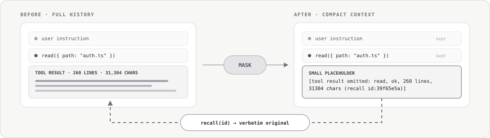

<div align="center">

# Maskpoint

**压缩噪音，保留回溯路径。**

[English](README.md) · **简体中文**

面向编码 Agent 的可移植混合上下文压缩：优先使用确定性掩码，仅在必要时执行一次受预算约束的检查点，并在宿主提供工具接口时逐字召回原文。



[](https://github.com/iefnaf/maskpoint/actions/workflows/ci.yml)
[](https://www.npmjs.com/package/@maskpoint/pi)
[](package.json)
[](LICENSE)

</div>

编码 Agent 会话的大部分上下文都被工具输出（observation）占据：文件内容、测试日志、命令输出、Diff 和图片。大多数压缩器会把这整段内容再次交给另一个模型，让它改写成自然语言摘要。Maskpoint 则把**值得记住的结构**与**可以暂时移走的内容**分开处理：

1. **先掩码。** 旧工具结果的正文被替换为简短、如实的占位符。用户指令、助手文本和工具调用保持原文；在原生适配器中，宿主保留的近期窗口也完全不动。整个过程是确定性的，不调用模型。
2. **只在上下文压力下，或收到明确要求时生成检查点。** 掩码后的历史持续累积，直到超过 token 预算；显式指定的压缩重点也可以提前触发同一路径。只有这些情况下，Maskpoint 才可能通过宿主现有的模型栈发起一次结构化检查点调用。
3. **始终留一条回去的路。** 每个掩码占位符都带有稳定的 `recall id`。目前在 Pi 中，Agent 可以使用这个 id 逐字取回原始会话条目，无需猜测已经省略的错误、路径或命令。

Maskpoint 不是向量数据库，不是第二套记忆系统，也不会引入新的模型服务商。它只是 Agent 现有会话历史之上的一层紧凑、能识别宿主能力的处理层。

## 压缩后保留什么

| 历史内容 | 掩码路径中的处理方式 |
| --- | --- |
| 用户指令和约束 | 原样保留 |
| 助手文本 | 原样保留 |
| 助手推理 | 默认原样保留；可选择掩码 |
| 工具名称和参数 | 原样保留 |
| 旧工具结果正文 | 替换为包含状态和大小的短占位符 |
| 旧观察中的图片 | 替换为文本元数据 |
| 宿主保留的近期窗口（原生适配器） | 完全不动 |

一段 31,304 字符的文件读取结果，会变成模型一眼就能理解的记录：

```text
read({"path":"src/auth.ts"})
[tool result omitted: read, ok, 260 lines, 31304 chars (recall id:39f65e5a)]
```

这个占位符不会假装概括原文：它只记录发生了什么、是否成功、省略了多少内容，以及原文在哪里。掩码操作是幂等的；原生适配器也只会在占位符确实比原文更小时进行替换。

## Recall：按需回到原文

如果后续工作依赖被省略内容中的精确文本，Agent 可以直接打开占位符，而不是靠猜：

```json
{ "id": "39f65e5a" }
```

Pi 适配器将它暴露为 Agent 可调用的 `recall` 工具。它从当前会话中读取原始条目并逐字返回，同时限制输出大小，并明确声明返回内容是历史记录而不是新指令。对于没有可用 id 的旧占位符，也可以通过关键词查询。

召回内容是**临时借用，而不是固定保留**：它会像普通上下文一样，在下一次压缩时再次被掩码。原始条目从未移动，因此同一个锚点始终可以再次使用。目前只有 Pi 接好了 `recall` 工具；查找和渲染逻辑位于平台无关的 core 中，其他适配器在宿主提供安全工具接口后可以复用同一能力。

完整设计、威胁模型、预算和模型实测记录见 [`docs/recall-tool.md`](docs/recall-tool.md)。

## 为什么仍然需要检查点

掩码移除了体积最大、信息密度最低的内容，但用户指令、决策、工具动作、推理和占位符仍会在超长会话中持续增长。因此，Maskpoint 把 LLM 摘要当作**压力释放阀**，而不是默认压缩算法。

```text
候选内容 = 上一次压缩状态 + 本次新移出的掩码历史

候选内容未超预算  → 返回掩码历史       （0 次模型调用）
候选内容超过预算  → 请求一次检查点     （1 次模型调用）
显式提供压缩重点  → 请求一次检查点     （1 次模型调用）
检查点被拒绝      → 返回已有掩码历史   （会话继续）
```

只有非空、完整且未调用工具的响应才会成为检查点。服务商错误、取消、输出截断、空响应或工具调用都会回退到已经生成好的掩码历史。在支持该能力的适配器中，也可以完全关闭检查点，得到可预测、无模型调用的压缩路径。

## 宿主支持

四个宿主提供的压缩接口并不等价，因此 Maskpoint 会明确标注接入层级。

| 宿主 | 层级 | 实际行为 | Recall |
| --- | --- | --- | --- |
| **Pi** | **原生替换** | 替换 Pi 在手动、阈值和溢出压缩中的原生摘要。默认只做掩码；超预算或执行 `/compact <focus>` 时最多生成一次检查点。 | **可用** |
| **DSH** | **原生替换** | 自动压力处理始终原地掩码，不调用模型。手动和显式区域压缩可以使用一次受预算约束的检查点。 | core 已支持；宿主工具尚未接入 |
| **Claude Code** | **辅助增强** | Claude Code 仍生成自己的摘要。Maskpoint 创建隐私安全的掩码产物，在可用时引导宿主摘要，随后重新注入并审计保真度。 | 宿主工具尚未接入 |
| **Codex CLI** | **辅助增强** | Codex 仍完全负责压缩。Maskpoint 提供状态保留指引，重新注入掩码产物，并记录宿主结果是可读、不透明还是无法确定。 | 宿主工具尚未接入 |

**原生替换**表示 Maskpoint 的输出直接成为压缩后的模型可见历史。**辅助增强**表示宿主压缩器仍然权威；Maskpoint 只在旁边补充能力，并且不会把两者混为一谈。

## 快速开始

### Pi

纯掩码压缩不需要额外的 API Key。如果需要生成检查点，Maskpoint 会使用 Pi 已配置的模型。

```sh
pi install npm:@maskpoint/pi
pi
```

在 Pi 中：

```text
/maskpoint                  # 查看或修改设置
/compact                    # 按正常预算策略压缩
/maskpoint checkpoint off   # 可选：只使用确定性掩码
```

从本地源码安装：

```sh
npm ci
npm run build
pi install ./packages/pi
# 或仅在本次运行中加载：
pi -e ./packages/pi
```

配置优先级、压缩元数据、失败原因和真实宿主录制测试见 [`packages/pi/README.md`](packages/pi/README.md)。

### DSH

```sh
dsh plugin add @maskpoint/dsh
```

DSH 的每个 context 只能挂载一个压缩后端，因此内置 Agent preset 需要复制一份，并替换其中的 `compaction-basic` 行。完整 YAML 和冒烟测试步骤见 [`packages/dsh/README.md`](packages/dsh/README.md)。

### Claude Code 与 Codex CLI

这两个适配器都属于辅助增强层级，需要按照各自宿主的插件、Hook 和信任流程安装：

- [Claude Code 安装与 Hook 生命周期](packages/claude-code/README.md)
- [Codex CLI 安装、压缩提示词接线与服务商侧压缩检测](packages/codex/README.md)

## 配置模型

core 的策略刻意保持精简。哪些设置可以由用户修改，取决于宿主及其扩展接口。

| 设置 | 默认值 | 作用 |
| --- | --- | --- |
| `enabled` | `true` | 关闭时跳过 Maskpoint，保留宿主原有行为 |
| `compactBudgetTokens` | 由适配器推导；否则为 `24000` | 触发检查点前允许累积的最大掩码历史 |
| `checkpointEnabled` | `true` | 在适配器拥有模型调用接口时，允许执行一次检查点调用 |
| `checkpointModel` | 宿主／会话模型 | 预留的模型覆盖项；当前限制见下文 |
| `maskReasoning` | `false` | 同时将旧助手推理替换为可召回占位符 |
| `notificationLevel` | `normal` | 控制常规压缩信息的输出级别 |

Pi 通过 `/maskpoint`、环境变量和命令行参数暴露当前可用设置。DSH 使用现有后端配置行，Claude Code 使用自己的 `settings.json`。Codex 目前使用引擎默认值；唯一的宿主侧选项是 Codex 自身配置中的压缩提示词接线。

`checkpointModel` 目前只为向前兼容而解析：Pi 仍使用当前会话模型，DSH 使用已有的摘要服务商／模型字段，辅助增强适配器则不会发起检查点调用。各适配器 README 记录了准确的配置入口和已知限制。

## 失败路径应当可预期

- **原生掩码不会膨胀上下文：** 如果占位符比原文更大，就保留原文；一次原生压缩必须严格缩小它替换的内容。
- **近期窗口由宿主决定：** 原生适配器复用宿主的切分点，不会在待压缩片段内部再创造第二个近期窗口。
- **检查点失败不等于会话失败：** 确定性的掩码候选内容已经准备好，可以直接回退。
- **适配器拒绝接管时不会破坏会话：** Pi 会交回自带的压缩器；DSH 保持历史不变，并报告宿主返回的压缩错误。
- **不引入新的外部网络端点：** 检查点调用只使用宿主已经配置的服务商。
- **不复制第二份原始记录：** 辅助增强适配器会先掩码所有观察，再写入派生状态；原始工具结果正文只留在宿主会话存储中。
- **Recall 只读且输出受限：** 它不能修改会话，也不会把一份旧日志变成新的上下文炸弹。

## 文档

| 文档 | 内容 |
| --- | --- |
| [`docs/design.md`](docs/design.md) | 架构、算法、适配器契约、失败矩阵和质量标准 |
| [`docs/spec.md`](docs/spec.md) | 问题定义、用户故事、实现决策和非目标 |
| [`docs/budget-calibration.md`](docs/budget-calibration.md) | 检查点预算默认值背后的测量依据 |
| [`docs/calibration-report.md`](docs/calibration-report.md) | 内部 token 估算器与 DSH token meter 的对比 |
| [`docs/reasoning-masking-evaluation.md`](docs/reasoning-masking-evaluation.md) | 掩码助手推理的实测取舍 |
| [`docs/recall-tool.md`](docs/recall-tool.md) | Recall 设计、实验、安全模型和输出上限 |

项目的研究基础是 [*The Complexity Trap: Simple Observation Masking Is as Efficient as LLM Summarization for Agent Context Management*](https://arxiv.org/abs/2508.21433)。Maskpoint 使用自己的语料、宿主样例、跨适配器一致性测试和校准报告来支撑项目级结论，而不会直接照搬论文参数。

## 开发

需要 Node.js 22 或更高版本。

```sh
npm ci
npm run build
npm run typecheck
npm run check:corpus
npm test
```

| 路径 | 职责 |
| --- | --- |
| [`packages/core`](packages/core) | 平台无关的掩码、累积、预算、检查点、配置和 Recall 基础能力 |
| [`packages/pi`](packages/pi) | Pi 原生替换适配器与 `recall` 工具 |
| [`packages/dsh`](packages/dsh) | DSH 原生压缩后端 |
| [`packages/claude-code`](packages/claude-code) | Claude Code Hook、产物注入和保真度审计 |
| [`packages/codex`](packages/codex) | Codex Hook、状态保留提示词、注入和压缩模式审计 |
| [`packages/corpus`](packages/corpus) | 共用脱敏语料与跨适配器一致性测试框架 |

测试套件使用确定性的模型替身以及录制或合成的宿主样例，不需要付费模型调用。发布流程会先执行类型检查和完整测试，随后按 core、各适配器的顺序发布。

## 许可证

[MIT](LICENSE)
