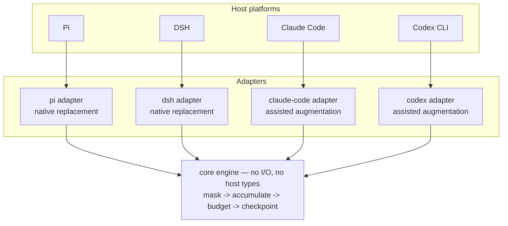
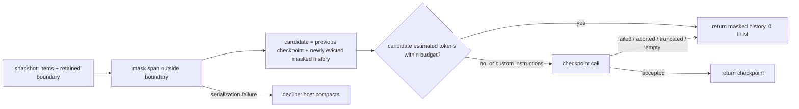

# Maskpoint — Design

**Status:** Draft for review · **Created:** 2026-09-21 · **Canonical:** this file · **Work anchor:** issue #1 · **Spec:** [`docs/spec.md`](spec.md)

## Objective

Provide one context-compaction algorithm — deterministic observation masking with a budgeted LLM checkpoint as a last resort — that runs unmodified in Pi, DSH, Claude Code, and Codex CLI, replacing the host's compactor where the host allows it and honestly augmenting it where it does not.

## Background

Every coding agent compacts by summarizing history with an LLM at the moment the session is already under pressure. That spends a model call to delete material which is mostly mechanical noise: file dumps, command output, test logs. JetBrains Research measured this directly and found masking stale observations instead matched or beat LLM summarization at roughly half the cost, and that a hybrid of the two beat both.

The first draft of this project was a Pi-only extension, because Pi is the one host that lets an extension return a replacement compaction result. That scope was wrong for the problem: the same person uses several agents, and a strategy that only exists in one of them produces one good session and three mediocre ones. Widening the scope turned out to be mostly additive — the algorithm is platform-free — and it forced one thing that a Pi-only design would have hidden: the four hosts are not equally capable, so the product has to state its integration tier rather than imply equivalence.

Prior art worth naming: the paper's reference implementation is a SWE-agent fork whose history processors already separate "mask observations" from "summarize every N turns". It is a good source for semantics and a bad source for parameters, because it hard-codes turn counts and observation windows that assume SWE-agent's scaffold. Our design replaces both with the host's own retained window and a token budget.

## Related documents

- Spec: issue #1, mirrored in `docs/spec.md` — problem, user stories, decisions, out of scope.
- Paper: *The Complexity Trap* (arXiv:2508.21433) and the `the-complexity-trap` reference implementation.
- Host API evidence: Pi compaction extension API, DSH compaction capability seam, Claude Code hooks reference, Codex hooks and compaction behaviour. Each is re-verified per host release; see Testing.

## Goals

- **One algorithm, four hosts.** The same masking rules, budget policy, checkpoint format, state reducers, and statistics everywhere; cross-platform differences appear only as adapter translation, and parity is asserted by tests rather than assumed.
- **Cheap by default.** Most compactions make no model call. Target: at least 70% of compactions complete with zero LLM calls, measured continuously.
- **Bounded over arbitrarily long sessions.** Masking slows context growth; the checkpoint budget bounds it. No session should be able to grow its own compacted summary without limit.
- **Never worse than not installed.** Every failure path ends in a usable artifact or in the host's own compaction. A session must never be left with no compaction result, an empty one, or a truncated one.
- **Honest capability reporting.** A user must be able to tell whether their host's compactor was replaced or merely supplemented, without reading source.

## Non-goals

- Replacing compaction on Claude Code or Codex CLI. Neither host accepts an externally produced history today; claiming otherwise is out of scope. Reaching that tier means forking or owning the agent loop.
- Rewriting the prompt on every model call (continuous request-time masking). It is the most faithful reading of the paper and it invalidates prompt-cache prefixes; deferred to an experiment.
- Cross-session memory, retrieval, or embeddings. Maskpoint manages one session's context, not a knowledge base.
- Exact provider tokenizer parity. Host meters are used where available; otherwise a conservative internal estimator.
- A user interface beyond what hosts already render.
- Matching the paper's benchmark or leaderboard numbers.

## Scenarios

**Pi, long refactor.** Threshold compaction fires after 180 turns. The adapter normalizes the pre-cut span, masks 140 observations, and returns masked history with zero model calls; the retained suffix is untouched. Ten compactions later the accumulated candidate crosses the budget, so one checkpoint call condenses it to a structured state block. Later, `/compact focus on the migration` forces a checkpoint and applies the focus.

**Claude Code, long debugging session.** Auto-compaction starts. The pre-compaction hook reads the transcript, produces the artifact, and prints a short steering directive. The host still writes its own summary. Immediately after, the post-compaction hook re-injects the artifact as fresh context, and the async audit records how much of the artifact the host summary failed to cover.

**DSH, manual compaction.** The user runs the host's compact command. The backend selects a balanced region, masks within it, and lands a model-free surface replacement carrying shadow pricing so the host's replay accounting stays correct. No model call, and the host's own pruner, if mounted, is not required to be removed. Between turns this replacement goes through the host's summary path with a Maskpoint envelope rather than the prune protocol; see Open issue 2.

## Architecture





## Glossary

| Term | Meaning |
|---|---|
| **Observation** | A tool result or command output — the bulky, low-density majority of a session. |
| **Masking** | Replacing an observation body with a compact placeholder. Deterministic, no model call. |
| **Masked history** | Serially rendered history in which observation bodies are replaced but user content, assistant text, reasoning, and tool calls are intact. Not an LLM summary. |
| **Checkpoint** | A model-generated structured state summary. Replaces accumulated masked history when the budget is crossed. |
| **Retained boundary** | The host's own cut point: everything after it is kept verbatim by the host. Adapter input, passed through unchanged. |
| **Candidate** | The exact text whose size the budget is compared against: previous checkpoint plus newly evicted masked history. |
| **Outcome** | The engine's platform-neutral result: strategy used, artifact, statistics, optional usage. |
| **Capability profile** | What an adapter can actually do: replace history, steer the host summarizer, re-inject context, persist metadata, honour cancellation, plus any injection cap. |
| **Native replacement** | Tier where the host accepts our result as model-visible history. |
| **Assisted augmentation** | Tier where the host keeps its compactor and we generate, steer, and re-inject. |
| **Decline** | The adapter returns no custom result so the host compacts normally. The universal last resort. |

## Constraints

- **No forks.** We integrate only through documented host extension points. Where a host cannot express a capability, we say so; we do not patch it.
- **No new network destination.** Checkpoints travel through the host's configured providers only.
- **No second copy of raw history.** Derived state may be persisted; observation bodies never are.
- **Host install semantics.** At least one host installs packages with development dependencies omitted, so every runtime dependency must be a production dependency. Node 22 or later.
- **Injection caps.** The assisted tier's documented re-injection channel caps a single injected string; artifacts must fit or point at the persisted derived state.
- **DSH seam invariants.** One backend mounted per context; replacements must preserve tool-call/result pairing; model-free replacement must carry accurate shadow pricing; summarization calls must record their envelope durably; a mounted token meter is the accounting authority.
- **Pi contract.** The pre-compaction event is the only full-replacement point; returning nothing is the documented fallback; a truncated result must not be persisted.

## Interfaces

### Normalized conversation

```ts
type Item = { id: string } & (      // id: unique within a snapshot; names positions
  | { kind: 'user'; text: string }
  | { kind: 'assistant-text'; text: string }
  | { kind: 'assistant-reasoning'; text: string }
  | { kind: 'tool-call'; name: string; callId?: string; args: string }
  | { kind: 'tool-result'; name?: string; callId?: string; status: 'ok' | 'error'
      exitCode?: number; text?: string; media: number; masked?: boolean }
  | { kind: 'checkpoint'; text: string }
  | { kind: 'host-context'; label: string; text: string }
  | { kind: 'opaque'; note: string }
)

interface ConversationSnapshot {
  items: Item[]
  boundary: { id: string }          // host cut point: the first item the host retains; opaque to the engine
  previousCheckpoint?: string       // text of the previous compaction's result, whichever strategy made it
  evictedThrough?: string           // id of the last item already represented in previousCheckpoint; the two come together or not at all
  previousDetail?: EngineDetail     // what the previous compaction persisted; carries the checkpoint count and file lists forward
  fileOps?: FileOps                 // file operations the host tracked for the span compacted now; merged into the earlier lists
  customInstructions?: string
  reason: 'manual' | 'threshold' | 'overflow'
}

interface CapabilityProfile {
  replaceHistory: boolean
  steerSummarizer: boolean
  reinjectContext: boolean
  persistMetadata: boolean
  honestCancellation: boolean
  injectionCapChars?: number
}

interface EngineDetail {            // persisted; never contains observation bodies
  v: 1
  engine: 'maskpoint'
  strategy: 'mask' | 'checkpoint'
  checkpoints: number
  stats: { observationsMasked: number; charsOmitted: number; candidateTokens: number }
  files?: FileOps                   // { read, written, edited: string[] } — paths only
  cursor?: { boundaryId: string; evictedThroughId: string }
}

type Outcome =
  | { kind: 'masked-history'; artifact: Artifact; detail: EngineDetail; stats: Stats
      checkpointRejection?: 'provider-error' | 'aborted' | 'truncated' | 'empty' | 'tool-call' }  // set when a checkpoint was tried and rejected
  | { kind: 'checkpoint'; artifact: Artifact; detail: EngineDetail; stats: Stats; usage?: Usage }
  | { kind: 'decline'; reason: DeclineReason }
```

### Adapter contract

```ts
interface Adapter {
  readonly id: 'pi' | 'dsh' | 'claude-code' | 'codex'
  readonly capabilities: CapabilityProfile
  compact(request: CompactRequest): Promise<AdapterEffect>
  audit?(request: AuditRequest): Promise<AuditResult>   // assisted tier only
}

interface CompactRequest {
  snapshot: ConversationSnapshot
  signal: AbortSignal
  host: HostPorts            // complete(), persist(), log(), now(), meter?()
}

type AdapterEffect =
  | { kind: 'native'; artifact: Artifact; boundary: { id: string }; detail: EngineDetail; usage?: Usage }
  | { kind: 'assisted'; artifact: Artifact; steering?: string; injections: Injection[]; detail: EngineDetail }
  | { kind: 'decline'; reason: DeclineReason }
```

`Artifact` is structured (ordered sections plus a statistics block), not a rendered string. Rendering happens at the adapter edge, which is why the same outcome can become a Pi summary string, DSH content blocks, or injected markdown.

### Engine entry

```ts
function run(input: ConversationSnapshot, budget: BudgetPolicy, deps: EngineDeps): Promise<Outcome>
function decide(input: ConversationSnapshot, budget: BudgetPolicy): Decision
// The decision layer under run(): synchronous and model-free, so the masked-history path cannot make a
// model call. Decision = Outcome | { kind: 'checkpoint-requested'; reason: 'over-budget' | 'custom-instructions';
// fallback: MaskedHistoryOutcome }. The fallback is what to return if the checkpoint call is rejected, and its
// artifact is the checkpoint's input. BudgetPolicy = { compactBudgetTokens: number }.
function estimateTokens(text: string): number
function maskSpan(items: Item[], boundary: { id: string }): { items: Item[]; stats: MaskStats }
// MaskStats = Pick<Stats, 'observationsMasked' | 'charsOmitted'>: candidateTokens belongs to accumulation.
// maskSpan returns only the compacted side (everything before the boundary) and throws MaskingError
// when the boundary or ids cannot be trusted, which an adapter turns into a decline.
function maskItems(items: Item[]): { items: Item[]; stats: MaskStats }
// maskSpan without the boundary: masks a span the caller has already cut, e.g. the newly evicted
// items once accumulation has dropped what earlier state already represents.

interface EngineDeps {
  complete(request: ModelRequest): Promise<ModelResponse>   // injected by the adapter; the core itself does no I/O
  newRoutingId(): string                                    // fresh identity, asked for once per checkpoint call
  signal: CancellationSignal                                // the host's signal, carried into the request
  checkpoint: { maxOutputTokens: number; model?: string }   // model absent = the session model
}
// ModelRequest = { model?, instructions, input, maxOutputTokens, routingId, cacheRetention: 'none',
//                  tools: [], signal }. ModelResponse.stopReason = 'stop' | 'length' | 'tool-call' | 'error' | 'aborted'.
// `run` is `decide` plus the one call: the masked-history path never touches `deps`. A rejected
// checkpoint returns the masked-history outcome with `checkpointRejection` set to why, so an adapter
// can log and count it; an accepted one returns `kind: 'checkpoint'` with the model's usage.
```

## Algorithms

### Masking

- Every observation outside the retained boundary is masked, subject to the no-expansion rule. There is **no second recency window** inside the compacted span: the host's retained region already is the recency window, and adding another would freeze full observations into successive compacted summaries where the host can no longer evict them.
- **Reasoning is masked only on request** (`MaskOptions.maskReasoning`, default off). The default follows requirement 9: the rationale behind the work is the part of a long session that only exists in prose, and the corpus shows it is not a restatement of the outcome — 74.1% of reasoning blocks hold at least one lookup-worthy identifier that appears nowhere else in what survives masking. When an operator opts in, reasoning outside the boundary becomes `[reasoning omitted: N lines, M chars]` under the same two rules as an observation (no expansion, no re-wrapping), and the count lands in `Stats.reasoningsMasked`. The measurement behind the trade-off — continuation unchanged, state recall better without reasoning, prompt tokens a third — is [`docs/reasoning-masking-evaluation.md`](reasoning-masking-evaluation.md); the checkpoint path is untested, which is why the default is off. **Rejected for now: a recency window inside the span** (\"keep the last K turns of reasoning\"), for the same accumulation reason as above — whatever stays verbatim becomes carried state that is never re-masked, so it would grow with every compaction instead of once.
- **No-expansion rule.** An observation stays verbatim when its placeholder would not be smaller, compared with the same estimator the budget uses. This is a compression-safety rule, not a recency rule, and it is what keeps masking from ever increasing context.
- **Idempotence.** Masking an already-masked placeholder is a no-op, and placeholders that were produced by a host-side pruner are recognized rather than re-wrapped. Required because DSH may mount its own deterministic pruner alongside Maskpoint.
- **Placeholder contents:** tool name when known, status, exit code when known, omitted lines and characters, omitted image count. Never the body, never a prefix or suffix of it.
- **Media** observations lose their payload and keep text metadata; images are the single worst context-per-information item in a long session.
- **Shell actions.** For hosts that express a command as part of the observation, the command is preserved as a tool call and only the output is masked.
- **Ordering and provenance.** Masked history preserves chronological order and labels roles explicitly, written so that recorded user and tool content reads as historical record rather than as an instruction the model should now follow.
- **Split turns.** A turn whose prefix is compacted keeps its request and its actions readable; only its observations are masked. The host's retained suffix is never duplicated into the compacted side.

### Accumulation

- Candidate = previous checkpoint (if any) followed by only the newly evicted masked history.
- "Newly evicted" is derived from the host's repeated-compaction boundary where one exists. Where a host exposes none, the adapter persists a cursor in `EngineDetail.cursor` and refuses to append when the cursor is missing or inconsistent — it declines instead of risking double-appending the same span.
- The cursor and the state it describes come together or not at all: state without `evictedThrough` could be appended to twice, and `evictedThrough` (or `previousDetail`) without state would drop the span it claims is kept. All decline (`inconsistent-cursor`), as does a cursor that names no item or reaches into the retained region. Empty previous state counts as no state. A cursor at the last item before the boundary is valid and appends nothing. With no previous state and nothing evicted there is nothing to return, and an empty artifact is never returned (`nothing-to-compact`).
- The previous state is carried forward verbatim and never re-masked, so a full observation cannot accumulate: every observation entered the state once, as a placeholder. **Naming caveat:** the carried state travels as `previousCheckpoint` and as an artifact section of kind `checkpoint` even when the compaction that produced it was mask-only, so it is then masked history, not a model-written checkpoint. The names predate this rule and are kept so the vocabulary does not churn; `EngineDetail.strategy` and `checkpoints` are the record of what actually ran. Renaming the field and section is a candidate cleanup once an adapter has to distinguish them. The result records a new cursor (`boundaryId` and the id of the last evicted item) for the adapter to feed back as `evictedThrough`.
- File-operation summaries supplied by the adapter are merged, not replaced, so a host that tracks read/written/edited files keeps that context across Maskpoint compactions. The earlier lists come from `previousDetail.files`, the host's newer operations from `fileOps`; the result is their order-preserving, de-duplicated union, and is absent when neither side has any.
- `EngineDetail.stats` describes this compaction: observations masked and characters omitted in the newly evicted span, and the candidate's estimated size. `checkpoints` is carried forward from `previousDetail` on the masked path.

### Budget

- The decision is one comparison: estimated size of the whole candidate against `compactBudgetTokens`. At or below budget the candidate is returned as masked history with zero model calls. Above budget — or whenever custom instructions are present — exactly one checkpoint call is made.
- The candidate is measured as one text: previous state, then the history framing and each newly evicted item under its role label and payload. The budget therefore counts the labels and framing an adapter's rendering adds, not just payloads. The comparison is written "within budget or not", so a budget or estimate that cannot be compared (NaN) takes the checkpoint path, never the masked one. Blank custom instructions are not instructions.
- The unit is tokens, not turns, because the paper's turn-count parameters were calibrated for a different scaffold and do not transfer. The paper's turn window maps onto the host's retained region; its summary interval maps onto this budget.
- The default is **derived from the model's context window** when the adapter can see one: a quarter of the window, clamped to [24,000, 96,000] (`deriveCompactBudget`); the flat fallback when it cannot is 24,000. These are measured tuning parameters, not derived constants — the calibration, the real-event coverage curves behind them, and the correction of the earlier 12,000-token default live in `docs/budget-calibration.md`. A pre-rename `checkpointTriggerTokens` key (and, on Pi, its `MASKPOINT_CHECKPOINT_TRIGGER_TOKENS` / `--maskpoint-checkpoint-trigger-tokens` channels) is still accepted with a deprecation warning.
- The estimator is deliberately conservative, weighting CJK text above its character count, so that non-English sessions cannot silently exceed the budget. Calibration against host-provided meters is an open issue.

### Checkpoint

- **Accepted** only when the model returns non-empty text with no error, abort, length stop, or tool call.
- **Rejected** outcomes fall back to masked history, never to an empty result and never to a partial checkpoint. A checkpoint truncated by the output cap is discarded, because it would become permanent session state.
- The request uses a fresh routing identity, disables prompt-cache retention, carries the host's cancellation signal, and exposes no agent tools.
- The prompt requests a fixed structured format: user context and constraints, completed work, pending work, current state, code state, tests with exact errors, changes, dependencies, version-control state, key decisions, next steps. The model may compress sections but must not invent state.
- Input is the accumulated masked history, not the original observation bodies — this is what makes the last-resort call cheaper than the host's default full-history summary.

### Configuration

- Shared engine settings, resolved by a pure, host-free function in core (`resolveEngineConfig`): `enabled`, `compactBudgetTokens`, an optional `checkpointModel`, `maskReasoning`, and `notificationLevel` (`'silent' | 'normal' | 'verbose'`). Everything an adapter needs to run is the returned `EngineConfig`; nothing about *where* the raw values came from crosses into core. Each helper that turns a setting into an engine input lives beside it (`budgetOf`, `deriveCompactBudget`, `maskOptionsOf`), so an adapter never maps a field by hand.
- Two raw layers in, one resolved config out: `global` always applies; `project` applies only when the caller says `projectTrusted: true` (docs/spec.md, Configuration — "an untrusted repository cannot choose my model or alter my compaction behavior"). An untrusted `project` layer is not parsed at all, so a malformed value inside it produces exactly one warning ("ignored: not trusted"), never a second, more specific one that would imply it was read.
- Each field is validated on its own: a value of the wrong type or out of range produces one warning and the field falls back to whatever the next-more-authoritative layer (or the documented default) would already say — never a thrown error, and never a decline. An unrecognized key produces the same shape of warning rather than being silently dropped or silently accepted.
- **As built (#8).** `resolveEngineConfig`/`resolveEngineConfigLayer` in `packages/core/src/config.ts` are exactly this: pure, no I/O, Seam-1-tested (`packages/core/test/config.test.ts`). What "global", "project", and "trusted" mean is host-specific and answered by each adapter, not by core:
  - **Claude Code** reads `.claude/settings.json`'s (and `.claude/settings.local.json`'s) own `maskpoint` field directly off disk — global `~/.claude/settings.json`, project the shared file overridden field-by-field by the local one — rather than through the host's already-flattened, env-merged process, which would erase the global/project distinction the trust rule needs. The project layer is always trusted: a PreCompact/PostCompact/SessionStart hook only runs after the host's own directory-trust dialog has already been accepted for that project, so the gate this rule exists to enforce has already run by the time the hook does. `enabled: false` makes the pre-compaction hook a pure no-op — no transcript read, no state written, no steering line — so a later hook invocation finds nothing to act on either.
  - **DSH** has only one config layer available to a plugin — cordis hands `compaction-basic`'s row `config:` a single already-merged object, with no signal for which part came from the host-plane profile versus a project-local preset copy — so it is resolved as the trusted `global` tier and no project/trust distinction is attempted (a known limit, not a gap this issue closes; see the DSH adapter section and its README). Maskpoint's three new row fields are declared `Schema.any()` in `MaskpointCompactionEngine.Config`, deliberately not type-checked by cordis's own loader: a throwing schema would take the whole backend down on a typo, the opposite of "warn and fall back". `checkpointModel` is not one of the three — the host's own `summarizationProvider`/`summarizationModel` already say who writes a checkpoint. `enabled: false` makes both `compactIfNeeded` and `summarize` delegate straight to `super`, i.e. the unmodified built-in backend this class extends.
  - **Pi** exposes no per-extension configuration channel of its own: a probe of a real release (issue #39) found no `config` on the handler's context and only the host's own `{ enabled, reserveTokens, keepRecentTokens }` at `event.preparation.settings`, with unknown keys in `settings.json` dropped before they ever reach a hook. Its package is still barred by its own test suite from importing anything beyond `@maskpoint/core` — no `node:fs`, no host SDK — so it cannot read a config file itself. It resolves three ordered layers instead (`resolveEngineConfigLayers`, added to core for this): the host object (`ctx.config`, kept first so a release that supplies one works unchanged), one `MASKPOINT_*` environment variable per field, and the extension's own CLI flags (`pi.registerFlag`, which is what puts them in `pi --help`). A flag typed for this run wins over the environment, which wins over the host object, and each layer warns under its own name ("invalid environment value for …"), so an operator can tell which surface to fix. Environment variables are not the host's native configuration location, which is a conscious trade against spec item 75 and the reason the flags exist beside them. Real per-project-versus-global layering for Pi remains unimplementable until a real release supplies something project-scoped. `checkpointModel` is accepted and validated but not yet wired to model selection, for the same reason the session's active model is still the only checkpoint model Pi supports (see the Pi adapter section, "Not yet").

## Adapter designs

### Pi

Pi's pre-compaction event fires for manual, threshold, and overflow compaction, and a returned custom result replaces the default summarize step. The adapter returns the host's prepared cut point unchanged, renders the artifact as the host's summary text, and stores `EngineDetail` in the compaction entry's details. Because Pi does not fold hook-produced details into later file tracking, the adapter merges the latest compatible details from the active branch with the current preparation's file operations. Custom instructions force a checkpoint. Foreign or older details are treated as absent. Branch/tree summarization is a separate Pi mechanism and is not covered.

**Zero-LLM path (issue #6).** The adapter normalizes the branch's session entries, not `preparation`'s messages, because only entries carry ids: an entry yields one item or several (an assistant turn is its reasoning, text and each tool call), with ids `<entry id>#<n>`. The retained boundary is the first item at or after `preparation.firstKeptEntryId`, and the returned cut point is that id, untouched. On a repeated compaction the previous compaction's summary is the carried state and its `firstKeptEntryId` is the cursor: that is where Pi itself restarts the span (or just after the compaction when that entry is gone), so it works the same whether Pi or Maskpoint wrote the earlier summary. The adapter reconciles its reading with Pi's before trusting it: Pi's `previousSummary` must be the one on the branch, and the number of conversation entries it normalized between the two cut points must equal the messages Pi prepared, so a Pi that changes what it counts as conversation declines instead of silently dropping history. Entries the adapter does not know are ignored, and a message shape it cannot represent declines only when it lies in the span being compacted, since Pi's retained region is never rendered.

The result must **strictly shrink** context: the rendered summary is compared with the previous summary plus the newly evicted history as Pi held it (an image counted at Pi's own 1,200-token estimate, which the text estimator cannot see), and a result that is not smaller declines. Framing and role labels cost tokens, so a span with little to mask can render larger than it was.

**As built (#7, checkpoints, focus, and file-op carryover).** The "latest compatible details" step scans the branch's compaction entries from the cut backward and reconstructs `EngineDetail` field by field, so a shape this adapter did not write — Pi's own `details`, an older or newer version, another engine, a malformed field — comes back absent rather than partially parsed, per the design's "Missing, malformed, older-version, or foreign compaction details are treated as absent" rule. This reaches past a compaction Pi's own compactor made in between, which is why the checkpoint count and file lists survive even when Pi wrote the most recent summary. File operations `preparation.fileOps` reports for the span just compacted are merged (union, first-seen order) with the earlier lists via `mergeFileOps`; Pi does not fold a hook-written compaction's details into what it tracks next, so this is the only path a checkpoint count or a read/written/edited path survives across a Maskpoint compaction.

The checkpoint call goes through `ctx.modelRegistry.complete` with the session's active model (there is no per-checkpoint model configuration yet); a missing model, a provider error, an abort, a length stop, a tool call, or an empty reply all fall back to the masked history the call was meant to condense, never to a decline, per the design's failure table. Custom instructions force the call even within budget, and reach the model as an appended instruction, never replacing the fixed checkpoint format. `checkpointRejection` on the returned effect and the extension's announcement say when a checkpoint was attempted and not accepted, so an over-budget session that could not get a checkpoint is never silently mistaken for one that did.

### DSH

The adapter implements the host's abstract compaction service and ships as an external package, installed as a host bundle that disables the built-in backend and inserts ours (Open issue 1). The host allows one backend per context, so it replaces the built-in rather than sitting beside it. All three entry points are honoured: automatic trigger, explicit idle-session compaction, and explicit region compaction, with the seam's pairing predicates validating region edges.

The durable representation of a **model-free** masked replacement depends on the entry point (Open issue 2; evidence in [`docs/spikes/dsh-model-free-replacement.md`](spikes/dsh-model-free-replacement.md)). The automatic entry lands per observation, in place, using the host's prune protocol: a shadow-price event immediately followed by a content-only tool-result replacement, once per masked observation, with no bracket and no envelope. The explicit entries run between turns, where the host's session invariant refuses in-place replacement, and `compactRegion` must return a compaction result that a prune landing cannot populate, so they land through the summary path: start marker, summary event carrying a Maskpoint envelope and no summarization-call marker, checkpoint-provenance replacement, end marker. Both keep the host's replay accounting exact. The host names the masked history on that path a "summary"; the glossary distinction between masked history and checkpoint still holds.

Checkpoint-path calls use the host's LLM seam and record provider, model, generation cap, and usage. Expected failures use the host's manual-compaction error vocabulary.

**As built (#10, masking only; the checkpoint path is #11).** The backend extends the host's built-in backend, so the explicit entries run through the host's own compaction transaction (lock, stability check, pairing validation, error classification, flush) and only the documented `summarize()` hook is ours: it normalizes the region's messages into engine items, runs `decide`, and renders the masked history as text under the `maskpoint`/`mask-only` envelope. A checkpoint heading the region is carried forward verbatim as the engine's previous state, never re-masked or re-framed. `compactIfNeeded` is overridden: the trigger is the host's own (threshold and retained window from the same resolved configuration, then a per-observation in-place landing over the surface up to the retained window), and it returns `null` because no summary ran. Overflow bypasses threshold and retained tail as the host's does, and the surface's `replaceGeneration` advancing is what tells the host's recovery loop to retry; if there was nothing left to mask it does not advance and the host surfaces the original error. The host's threshold and retention arithmetic and range selection are not exported by the published package (a deviation from "do not reimplement trigger logic" that the seam forces, until upstream re-exports them), so they are restated and pinned to the built-in by a parity test that runs both over the same configurations, including a tie at the retention boundary; the pin compares which observations each side masks, not the raw cut. The open-turn and compaction-lock inspection that guards an automatic landing is restated the same way and is not pinned by a parity test (its `session/end-seed` branch is untested); the host transaction guards the explicit entries itself. An aborted turn signal is honoured before anything lands, since the landing is synchronous and cannot be interrupted after that.

*Composition with the host's pruner needs no ordering rule.* The pruner's output is recognized by its marker when normalizing and left as the host wrote it (`masked: true`), so a result it already reduced is never re-wrapped; a result Maskpoint masked first is far below the pruner's threshold, so the pruner never wraps it. With the built-in backend replaced nobody would run the pruner, so the backend runs it after masking, exactly where the built-in did, and the host's safety net keeps working on the retained window. Present, absent, and already-run are each tested, and the marker constant is pinned to the host's.

*Known limits of the masking-only landing.* Statistics are logged, not persisted (`persistMetadata: false`); the host's summary event has no field for `EngineDetail`. An explicit compaction with nothing worth masking fails with the host's `summary` error (a masked replacement could only grow), which is the honest outcome. If masking alone leaves the surface above the trigger, the backend warns once per stretch above the line (also when there was nothing left to mask) and does not compact further until #11 adds the checkpoint path. Each compaction logs its strategy, counts and, on the explicit path, the candidate estimate; a decline logs its reason. Images in user messages are noted as omitted rather than carried.

### Claude Code

Three entry points: pre-compaction (read the transcript, run the engine, write the artifact, print a short steering directive), post-compaction (audit and record drift), and post-compaction context injection (deliver the artifact).

Correctness depends only on the documented re-injection channel. The pre-compaction hook's standard output is used to steer the host's summarizer where that channel exists, but the adapter must remain correct if it disappears, because it is not part of the documented contract. Maskpoint never blocks compaction: the hook payload cannot distinguish proactive automatic compaction from recovery-after-overflow, and blocking the latter surfaces the underlying request failure to the user.

The host's own summary is still produced and still occupies context; the artifact rides alongside it. Only derived state is written to disk.

### Codex

Strictly assisted: pre-compaction and post-compaction hooks exist, but the host cannot accept an externally produced replacement history. The adapter pushes preservation instructions into the host's summarization-prompt configuration where that configuration is available, re-injects the artifact after root-session compaction through the documented channel, and detects whether provider-side native compaction is active for the current authentication mode so the reported tier reflects reality.

## Failure and fallback

| Stage | Failure | Result |
|---|---|---|
| Snapshot | Host conversation unreadable or unrecognized | Decline → host compacts |
| Masking | Serialization error, non-monotonic ids, ambiguous pairing | Decline → host compacts |
| Accumulation | Missing or inconsistent cursor | Decline → host compacts |
| Budget | Estimation overflow | Checkpoint path |
| Checkpoint | Provider error, abort, length stop, empty text, tool call | Masked history |
| Checkpoint | Model missing or unauthenticated | Masked history |
| Native result | Not smaller than what it replaces (`no-size-reduction`) | Decline → host compacts |
| Native result | Custom instructions and no checkpoint path (`checkpoint-unavailable`) | Decline → host compacts |
| Any stage | Unexpected fault (`engine-failure`) | Decline → host compacts |
| Native apply | Host rejects the result | Decline → host compacts |
| Persistence | Metadata write fails | Emit the result; log; do not lose the compaction |
| Assisted inject | Over the injection cap | Inject a pointer to persisted state |

Two invariants: an empty artifact is never returned, and a truncated checkpoint is never persisted.

## Security and privacy

- **Threat: an untrusted repository influencing compaction.** Project-level configuration overrides global configuration only in a trusted project; otherwise it is ignored with a warning.
- **Threat: a second copy of sensitive output on disk.** The artifact contains user and assistant text that already exists in the host transcript, plus placeholders — never observation bodies. Derived state gets the same file permissions and location discipline as the host's own session data. The artifact must never contain credentials, environment dumps, or key material that appeared only inside a masked observation.
- **Threat: compaction as an exfiltration channel.** Checkpoint requests go to models the user already configured in the host. Maskpoint adds no endpoint.
- **Threat: hook execution.** Installation follows each host's own trust review; Maskpoint never asks for trust bypass in normal operation.
- **Threat: a corrupted session.** Persisted state is versioned; unknown versions are treated as absent rather than parsed, and no code path can persist a checkpoint it did not accept.

## Logging

Log per compaction: strategy, observation count masked, characters omitted, candidate token estimate, whether a checkpoint ran, its usage, and the decline reason when applicable. Log levels follow the host. Never log observation bodies, never log credentials, and never log full artifact text. Retention is the host's.

## Quality bars and measurement

| Bar | Target | How it is observed |
|---|---|---|
| Zero-LLM compactions | ≥70% | Counter ratio in persisted statistics; warning below 50% over a week |
| Usable result | 100% — masked history, checkpoint, or clean decline | Unit and conformance tests plus a runtime counter of decline reasons |
| Context decreases | Strict decrease on every native compaction | Before/after token estimates per compaction |
| Cross-platform parity | Zero unexplained divergence on the shared corpus | Parity test in CI |
| Host API drift | Detected before release, not in production | Conformance fixtures recorded per host release |
| Checkpoint safety | Zero persisted truncated or empty checkpoints | Rejection-path tests plus a counter of rejected checkpoints |

## Timeline

| Milestone | Visible artifact |
|---|---|
| M0 — core engine and Seam 1 tests | Masking, budget, and checkpoint behaviour on the shared corpus, with no host involved |
| M1 — Pi adapter, dogfooded | Compaction entries in real Pi sessions showing strategy and statistics; zero-LLM ratio from real usage |
| M2 — DSH adapter | A selectable backend preset in a DSH preset, with the host's own accounting staying correct |
| M3 — assisted adapters | Claude Code first, then Codex; drift audit numbers from real sessions |
| M4 — calibration and tuning report | Estimator-versus-meter comparison and revised defaults |

## Testing design

Two seams, each at the top of its layer.

**Seam 1 — engine over a neutral snapshot.** Items and budget in, outcome out. Covers classification, masking scope, no-expansion, idempotence, accumulation across repeated compactions, budget boundaries, checkpoint acceptance and rejection, and statistics. No host, no network, no model.

**Seam 2 — adapter conformance over recorded host artifacts.** Recorded session file or hook payload in, effect plan and rendered payload out. Covers parsing, normalization fidelity, boundary pass-through, rendering, persistence, capability reporting, and degradation.

One sanitized fixture corpus drives both: directly for Seam 1, and through each host's recording for Seam 2, so cross-platform parity is asserted instead of assumed. Legitimate host differences are explicit expectations in the parity test, not silent exceptions. Checkpoint tests use a deterministic model double covering success, error, abort, length stop, tool call, and empty response. Sanitization is checked in CI. DSH conformance topologies mount the host's session and compaction invariant companions, which are the executable form of the seam contract; a search of the shipped host found no mount of them, so they are not a runtime guard. Host-dependent smoke tests are documented manual procedures, not CI requirements, because CI has no host binaries.

**As built (#12, cross-platform parity harness).** `packages/corpus/test/parity.test.ts` compares the two adapters that reach the native-replacement tier — Pi and DSH; Claude Code and Codex are assisted augmentation and produce no masked-history replacement to compare (see Non-goals). Every corpus fixture is synthetically encoded as the artifact each host's own boundary and cursor accounting expects (`packages/corpus/test/support/{pi,dsh}-encoding.ts`): the `session_before_compact` event Pi would fire, carrying the full branch; and the region DSH's compaction transaction would hand `summarize()`, pre-cut to the previous checkpoint (if any) followed by only the newly evicted items. Not live recordings — synthetic ones, built from the same corpus fixture for both hosts, since CI has no host binaries (as above) — but each is driven through the adapter's real, exported entry point: `planCompaction`, and `MaskpointCompactionEngine.prototype.summarize` called unbound against a minimal fake logger, so the harness needs no cordis host for the parity claim itself (dsh's own conformance suite, `packages/dsh/test/`, exercises the surrounding transaction). Outcome, statistics, and rendered masked-history text are compared. A new fixture is compared by default; excluding one needs a named reason in the test file's `EXCLUDED` map, itself checked by a test. Two fixtures are excluded today, each pinned by a dedicated pair of tests rather than silently skipped: `cjk` (its `customInstructions` sends Pi down `checkpoint-unavailable` while DSH's engine, which does not yet read that field at all, masks normally instead — genuinely different paths, not a rendering difference) and `parallel-tool-calls` (Pi's own no-size-reduction guard, measured by Maskpoint's estimator, and DSH's host-level guard, measured by the host's own token meter, disagree on content this close to their respective break-even points; calling `summarize()` directly bypasses the transaction that runs DSH's guard, so this harness cannot settle what a real DSH host would decide here — a candidate for a future, cordis-backed variant of this harness). `pre-masked` (a host-side pruner placeholder) needs no exclusion: the no-expansion rule leaves its already-small bodies alone on both adapters regardless of whether the `masked` flag or DSH's pruner-marker text is what stopped them, so it runs through the ordinary comparison and matches.

## Open issues

1. **DSH packaging — in-tree backend or external plugin. Decided by spike #9: external package.** It ships as a DSH bundle that disables the built-in `compaction-basic` row and inserts ours; the host allows one backend per context, so adding it beside the built-in is rejected. A bundle patch's `name` is only a guard and cannot retarget a row, so the swap is a disable plus an insert. This follows the "documented extension points only" constraint, keeps the shared core in our workspace, and leaves our release cadence independent of the host's. **Rejected: in-tree sibling.** It would make the backend selectable from the shipped presets, but it makes us a contributor to a repository we do not control, forces the host to depend on our core or vendor it (breaking "one algorithm"), and couples releases. Nothing in the evidence required it. **Preset realm question, settled by #10: workable, so the decision stands.** The shipped `standard`, `code`, and `cordis` presets each mount the built-in backend in their own isolated `compaction` realm (a group holding the backend, `/compact`, and the pruner) and have no patch layer, so an agent in a shipped preset needs a user-authored preset copy with that one row's `name` changed to `@maskpoint/dsh`. Agents resolve the realm's `compaction` service inside that group, so `/compact` and the automatic listeners reach whichever backend the row names. A preset row's bare package name resolves from the host base, which for an installed profile is the profile directory whose `node_modules` holds packages added with `dsh plugin add` (read from `dsh-agent-presets` and `app-boot` source; not run through the real launcher, so a manual smoke procedure remains in `packages/dsh/README.md`). Exercised in tests: a real-Loader composition shaped like the shipped presets' compaction group, row swapped, `/compact` executed through the real command plane and landing under Maskpoint's envelope; a second backend beside the built-in refused; and the bundle patch (`cordis.patch.yml`, disable plus insert) selecting it on the host plane. Version: the spike ran against DSH commit `47f943859b` (0.1.0-rc.5), which was never published; #10 builds and tests against the published `0.1.0-rc.8` family, and the spike's characterization suite reproduces on it with identical accounting figures (9,054→5,652 and 9,054→5,641). Evidence: [`docs/spikes/dsh-model-free-replacement.md`](spikes/dsh-model-free-replacement.md).
2. **DSH model-free replacement event. Decided by spike #9: by entry point.** *Automatic entry* (`compactIfNeeded`): the host's prune protocol, in place. Per masked observation, a shadow-price event then a content-only tool-result replacement citing the shadowed node; no bracket, no envelope. It is the only shape the seam's invariants accept that is also honest about authorship, it uses the same protocol on the same nodes as the host's own pruner (verified by #10: no ordering rule is needed; see the DSH adapter section), and it fits `compactIfNeeded`'s documented null return when no summary ran. *Explicit entries* (`compactNow`, `compactRegion`): the summary path with envelope `provider: maskpoint`, `model: mask-only`, no summarization-call marker, no usage. The session invariant refuses in-place replacement between turns, and `compactRegion` must return a compaction result that a prune landing cannot populate; `compactNow` returning null would make `/compact` report "No compactable history yet." after masking had landed. Host token accounting stays exact under both: the meter total, the priced surface, and both replay projections agree, and the total falls by exactly the priced delta. A replacement with no shadow price makes replay drift, so the shadow price is mandatory. **Rejected: the prune protocol for everything.** The region-level forms cannot land: with checkpoint provenance inside a bracket it is refused at the bracket's close because the host requires one summary event, leaving the surface replaced and the lock open; with provenance and no bracket it is refused outright; a plain unbracketed replacement lands but is not a recognisable compaction checkpoint and takes no lock. **Rejected: the summary path for everything with the routed model as envelope.** It attributes masked history to a model that did not write it, and the host's trajectory view presents that envelope as a completed compaction request. The Maskpoint envelope on the explicit entries is a reluctant fallback: it is honest about the author but still appears as a compaction request with no usage. The clean fix is upstream, letting a prune shadow price satisfy a bracket's summary requirement and making the result's summary event optional; that is not required for v1 and nothing assumes it. The summarization-call marker is optional on the summary path: it is present only when a call went through the host's LLM seam. Evidence: [`docs/spikes/dsh-model-free-replacement.md`](spikes/dsh-model-free-replacement.md).
3. **Codex provider-side native compaction.** Whether the host checkpoint is provider-opaque under ChatGPT authentication changes how much value re-injection adds. Next step: run both authentication modes, inspect a rollout, and compare.
4. **Value of the assisted tier.** Risk that it costs a second copy of similar text for little gain beyond audit. **Decided by #17, provisionally: the default stays assisted augmentation; the decision to flip to audit-only is not made yet.** No real Claude Code session has run this adapter on this repository's development machine: no `audit.jsonl` exists there at all (checked once, not surveyed across a fleet), so there is no real-session coverage or duplication-cost number to decide from. The repository's only conversation data is the sanitized synthetic corpus (`packages/corpus/fixtures`, built for Seam 1/2 tests), which pairs no host-generated summary with an artifact at all — using it here would present fabricated numbers as production evidence, contrary to this design's own "Honest capability reporting" goal. What #17 built instead is the missing half of the measurement: `summarizeAudit`'s `AuditSummary` (`packages/claude-code/src/audit.ts`) now reports duplication cost alongside coverage — `meanArtifactChars`, `meanHostSummaryChars`, `meanDuplicationRatio` (the mean, across compactions with both sizes and a non-zero host summary, of `artifactChars / hostSummaryChars`), and `duplicationRatioSamples` (how many compactions that mean is actually drawn from, since a zero-length host summary is excluded from the ratio to avoid dividing by zero yet is the case where the artifact plausibly adds the most value — the sample count keeps that exclusion visible instead of silently skewing the mean) — so `maskpoint-claude-code audit-summary` surfaces both halves of this trade-off (coverage the artifact adds versus its own context cost) as soon as real compactions accumulate; each `audit.jsonl` line already carried the raw `artifactChars`/`hostSummaryChars` per compaction (#14), so this is aggregation, not new instrumentation. **Revisit bar**, to apply once real compactions have accumulated over a meaningful stretch of real usage (the originally planned two-week dogfooding window, or longer if the sample still looks too thin to trust): default to audit-only if `meanDuplicationRatio` is materially above 1 — the artifact costing more context than the host's own summary — while `meanCoverage` is not correspondingly higher than what the host's summary already achieves on its own; keep assisted augmentation if the artifact's coverage advantage justifies its size. Setting the exact numeric thresholds, and judging whether `duplicationRatioSamples` is large enough to trust, is deferred to whoever reads the first real report, not guessed here without evidence.
5. **Continuous request-time masking.** Could capture the paper's full benefit on hosts that express a per-request context hook, at the cost of prompt-cache invalidation. Next step: prototype and measure cache impact before considering it.
6. **Stability of the Claude Code steering channel.** It is real but undocumented. Next step: feature-detect it at runtime and confirm the artifact-only path remains sufficient when it is gone.

## Resolved issues

- **R10 — Masking assistant reasoning (#43).** Off by default, reachable through the same configuration surface as every other engine setting (`MaskOptions.maskReasoning`, `EngineConfig.maskReasoning`, `maskOptionsOf`): reasoning outside the retained boundary becomes a size-only placeholder, under the same no-expansion and idempotence rules as an observation, and is counted separately in `Stats.reasoningsMasked`. Decided by measurement rather than intuition: masking removes 62.6% of an evicted span but leaves 79.5% of what survives in reasoning (36.8%) and tool-call arguments (42.7%), and a 40-pair A/B found no task metric separating the arms (tool choice 5 vs 4 discordant pairs, state recall within half a percentage point, 95% CI spanning zero) while keeping reasoning cost 39% more prompt tokens on average — full method, numbers and caveats in [`docs/reasoning-masking-evaluation.md`](reasoning-masking-evaluation.md). **Rejected: on by default.** The checkpoint path is untested: it feeds the same text to the summarizer, and a checkpoint written from stubbed reasoning has not been compared with one written from full reasoning. **Rejected: a recency window inside the span.** Same reason the observation rule has none (see Masking). **Rejected: leaving it unreachable.** Before this, the setting did not exist at all and the promise in requirement 9 was the only behaviour available, which is a fine default but not a decision an operator could make.
- **R9 — Pi's configuration channel (#39).** Pi hands an extension no settings at all, so the adapter resolves three ordered layers — the host object (`ctx.config`), `MASKPOINT_*` environment variables, and its own CLI flags — through a new `resolveEngineConfigLayers` in core; a flag typed for this run wins over the environment, which wins over the host object. Chosen because it is the only channel set that works on today's Pi without breaking the package's no-I/O rule (`test/package.test.ts` pins every import to a relative module or `@maskpoint/core`, and the package ships the TypeScript source Pi loads itself). **Rejected: reading `.pi/settings.json` and `~/.pi/agent/settings.json` directly.** It is the host's native location, but it would mean adding `node:fs` to a package whose own test forbids it, and it reopens the global-versus-project trust question: `ctx.cwd` and `ctx.isProjectTrusted()` exist, but which settings an untrusted repository may influence is a design decision rather than an implementation detail, and the spec's answer (`project` applies only in a trusted project) needs a layer split this host does not currently offer. **Rejected: doing nothing.** It leaves spec items 71–73 unimplementable on Pi — the trigger budget, the notification level, and the disable switch were all unreachable, which is how a real 215k-token session ended up making a checkpoint call its operator could not raise the threshold above.

- **R1 — Name.** Maskpoint, from Mask + Checkpoint. Rejected `context-fold` and `ctxfold`: both are taken on npm, and one of them is a Pi extension with nearly identical positioning.
- **R2 — Cut point and recency window.** The host's cut point is passed through unchanged and is the only full-fidelity recent window. A second window inside the compacted span was rejected because those observations become un-evictable once embedded in a summary, so repeated compactions accumulate full stale output.
- **R3 — Trigger-time, not continuous.** Masking runs when the host compacts, not on every request. Chosen for correctness and cache safety; the paper's always-on masking stays a later experiment.
- **R4 — Two test seams.** Engine over neutral snapshots plus adapter conformance over recorded artifacts. A single per-platform end-to-end seam was rejected because the assisted tier cannot express "model-visible history out" in a test, and a core-only seam would leave the highest-risk translation code uncovered.
- **R5 — Pi state location.** Compaction-entry details rather than a sidecar file, so resuming or reloading restores state with the session.
- **R6 — Tier naming.** Native replacement versus assisted augmentation, published per adapter, so a supplemented host is never described as replaced.
- **R7 — Estimator calibration (#16).** Compared against DSH's own real token meter over the shared corpus (raw pre-mask region on both sides): the internal estimator reads 8–21% higher than DSH's meter on every non-CJK fixture, and roughly double on the CJK fixture — both in the conservative direction, and the CJK gap is corrective, matching DSH's own documentation that its flat 4-chars/token heuristic underprices CJK. No constant changed; the evidence supports the existing weights rather than a different set. Full comparison, methodology, and the corpus-wide quality-bar numbers (zero-LLM ratio, usable-result rate, context-decrease, checkpoint safety, parity drift) in [`docs/calibration-report.md`](calibration-report.md).
- **R8 — npm distribution naming.** One scope, `@maskpoint/*`: `@maskpoint/core` plus one package per adapter. The package names are not just a publishing convenience — the DSH bundle patch and the shipped presets name `@maskpoint/dsh` as the row that resolves from the profile, so bare `maskpoint-*` names would have meant editing installed-host configuration to match a registry choice. The name was re-checked against npm before release: `maskpoint` and every `maskpoint-*` candidate are unclaimed, while `context-fold` and `ctxfold` remain taken (R1). **Rejected: an umbrella package holding all four adapters.** It would carry every host's manifests and dependencies into every install — a Codex user would receive Pi's extension source — to buy one version number. **Rejected: a personal scope.** The brand scope is neutral about which account owns it, and the repository is public, so leaving the namespace unclaimed invites an impostor instead of naming a competitor.

## Alternatives considered

- **Fork Claude Code or Codex to reach the native tier.** Rejected: high maintenance cost, immediate breakage on release, and it makes the tool unusable for anyone unwilling to run a patched agent.
- **Own the agent loop through a vendor SDK.** Rejected for v1: it abandons the hosts' own features, permissions, and integrations to gain control we mostly already have on two of four platforms.
- **Pure masking, no checkpoint.** Rejected: masking cannot bound growth, so very long sessions still degrade.
- **Masking the host artifact, not making one.** Rejected: on the native tier we already control the result; on the assisted tier we need our own artifact to inject and to audit.
- **A per-platform algorithm with shared configuration only.** Rejected: this is where the project started, and it produces four subtly different behaviours and four sets of bugs.
- **Rendering the artifact to plain text inside the engine.** Rejected: DSH needs content blocks and structured state, assisted hosts need markdown within a character cap, and persisted state must be machine-readable. Rendering belongs at the adapter edge.
