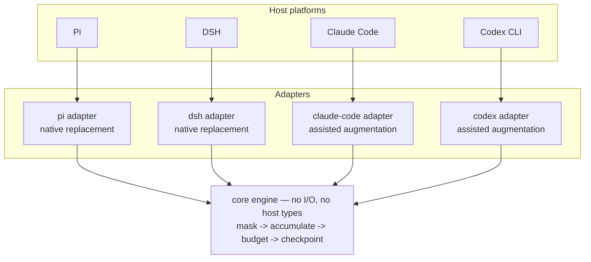
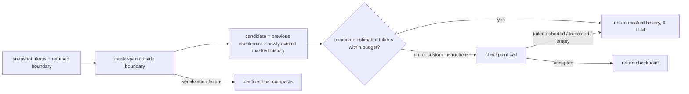

# Maskpoint — Design

**Status:** Draft for review · **Created:** 2026-09-21 · **Canonical:** this file · **Work anchor:** issue #1 · **Spec:** [`docs/spec.md`](spec.md)

## Objective

Provide one context-compaction algorithm — deterministic observation masking with a budgeted LLM checkpoint as a last resort — that runs unmodified in Pi, DSH, Claude Code, and Codex CLI, replacing the host's compactor where the host allows it and honestly augmenting it where it does not.

## Background

Every coding agent compacts by summarizing history with an LLM at the moment the session is already under pressure. That spends a model call to delete material which is mostly mechanical noise: file dumps, command output, test logs. JetBrains Research measured this directly and found masking stale observations instead matched or beat LLM summarization at roughly half the cost, and that a hybrid of the two beat both.

The first draft of this project was a Pi-only extension, because Pi is the one host that lets an extension return a replacement compaction result. That scope was wrong for the problem: the same person uses several agents, and a strategy that only exists in one of them produces one good session and three mediocre ones. Widening the scope turned out to be mostly additive — the algorithm is platform-free — and it forced one thing that a Pi-only design would have hidden: the four hosts are not equally capable, so the product has to state its integration tier rather than imply equivalence.

Prior art worth naming: the paper's reference implementation is a SWE-agent fork whose history processors already separate "mask observations" from "summarize every N turns". It is a good source for semantics and a bad source for parameters, because it hard-codes turn counts and observation windows that assume SWE-agent's scaffold. Our design replaces both with the host's own retained window and a token budget.

## Related documents

- Spec: issue #1, mirrored in `docs/spec.md` — problem, user stories, decisions, out of scope.
- Paper: *The Complexity Trap* (arXiv:2508.21433) and the `the-complexity-trap` reference implementation.
- Host API evidence: Pi compaction extension API, DSH compaction capability seam, Claude Code hooks reference, Codex hooks and compaction behaviour. Each is re-verified per host release; see Testing.

## Goals

- **One algorithm, four hosts.** The same masking rules, budget policy, checkpoint format, state reducers, and statistics everywhere; cross-platform differences appear only as adapter translation, and parity is asserted by tests rather than assumed.
- **Cheap by default.** Most compactions make no model call. Target: at least 70% of compactions complete with zero LLM calls, measured continuously.
- **Bounded over arbitrarily long sessions.** Masking slows context growth; the checkpoint budget bounds it. No session should be able to grow its own compacted summary without limit.
- **Never worse than not installed.** Every failure path ends in a usable artifact or in the host's own compaction. A session must never be left with no compaction result, an empty one, or a truncated one.
- **Honest capability reporting.** A user must be able to tell whether their host's compactor was replaced or merely supplemented, without reading source.

## Non-goals

- Replacing compaction on Claude Code or Codex CLI. Neither host accepts an externally produced history today; claiming otherwise is out of scope. Reaching that tier means forking or owning the agent loop.
- Rewriting the prompt on every model call (continuous request-time masking). It is the most faithful reading of the paper and it invalidates prompt-cache prefixes; deferred to an experiment.
- Cross-session memory, retrieval, or embeddings. Maskpoint manages one session's context, not a knowledge base.
- Exact provider tokenizer parity. Host meters are used where available; otherwise a conservative internal estimator.
- A user interface beyond what hosts already render.
- Matching the paper's benchmark or leaderboard numbers.

## Scenarios

**Pi, long refactor.** Threshold compaction fires after 180 turns. The adapter normalizes the pre-cut span, masks 140 observations, and returns masked history with zero model calls; the retained suffix is untouched. Ten compactions later the accumulated candidate crosses the budget, so one checkpoint call condenses it to a structured state block. Later, `/compact focus on the migration` forces a checkpoint and applies the focus.

**Claude Code, long debugging session.** Auto-compaction starts. The pre-compaction hook reads the transcript, produces the artifact, and prints a short steering directive. The host still writes its own summary. Immediately after, the post-compaction hook re-injects the artifact as fresh context, and the async audit records how much of the artifact the host summary failed to cover.

**DSH, manual compaction.** The user runs the host's compact command. The backend selects a balanced region, masks within it, and lands a model-free surface replacement carrying shadow pricing so the host's replay accounting stays correct. No model call, and the host's own pruner, if mounted, is not required to be removed. Between turns this replacement goes through the host's summary path with a Maskpoint envelope rather than the prune protocol; see Open issue 2.

## Architecture





## Glossary

| Term | Meaning |
|---|---|
| **Observation** | A tool result or command output — the bulky, low-density majority of a session. |
| **Masking** | Replacing an observation body with a compact placeholder. Deterministic, no model call. |
| **Masked history** | Serially rendered history in which observation bodies are replaced but user content, assistant text, reasoning, and tool calls are intact. Not an LLM summary. |
| **Checkpoint** | A model-generated structured state summary. Replaces accumulated masked history when the budget is crossed. |
| **Retained boundary** | The host's own cut point: everything after it is kept verbatim by the host. Adapter input, passed through unchanged. |
| **Candidate** | The exact text whose size the budget is compared against: previous checkpoint plus newly evicted masked history. |
| **Outcome** | The engine's platform-neutral result: strategy used, artifact, statistics, optional usage. |
| **Capability profile** | What an adapter can actually do: replace history, steer the host summarizer, re-inject context, persist metadata, honour cancellation, plus any injection cap. |
| **Native replacement** | Tier where the host accepts our result as model-visible history. |
| **Assisted augmentation** | Tier where the host keeps its compactor and we generate, steer, and re-inject. |
| **Decline** | The adapter returns no custom result so the host compacts normally. The universal last resort. |

## Constraints

- **No forks.** We integrate only through documented host extension points. Where a host cannot express a capability, we say so; we do not patch it.
- **No new network destination.** Checkpoints travel through the host's configured providers only.
- **No second copy of raw history.** Derived state may be persisted; observation bodies never are.
- **Host install semantics.** At least one host installs packages with development dependencies omitted, so every runtime dependency must be a production dependency. Node 22 or later.
- **Injection caps.** The assisted tier's documented re-injection channel caps a single injected string; artifacts must fit or point at the persisted derived state.
- **DSH seam invariants.** One backend mounted per context; replacements must preserve tool-call/result pairing; model-free replacement must carry accurate shadow pricing; summarization calls must record their envelope durably; a mounted token meter is the accounting authority.
- **Pi contract.** The pre-compaction event is the only full-replacement point; returning nothing is the documented fallback; a truncated result must not be persisted.

## Interfaces

### Normalized conversation

```ts
type Item = { id: string } & (      // id: unique within a snapshot; names positions
  | { kind: 'user'; text: string }
  | { kind: 'assistant-text'; text: string }
  | { kind: 'assistant-reasoning'; text: string }
  | { kind: 'tool-call'; name: string; callId?: string; args: string }
  | { kind: 'tool-result'; name?: string; callId?: string; status: 'ok' | 'error'
      exitCode?: number; text?: string; media: number; masked?: boolean }
  | { kind: 'checkpoint'; text: string }
  | { kind: 'host-context'; label: string; text: string }
  | { kind: 'opaque'; note: string }
)

interface ConversationSnapshot {
  items: Item[]
  boundary: { id: string }          // host cut point: the first item the host retains; opaque to the engine
  previousCheckpoint?: string
  evictedThrough?: string           // id of the last item already represented in state
  customInstructions?: string
  reason: 'manual' | 'threshold' | 'overflow'
}

interface CapabilityProfile {
  replaceHistory: boolean
  steerSummarizer: boolean
  reinjectContext: boolean
  persistMetadata: boolean
  honestCancellation: boolean
  injectionCapChars?: number
}

interface EngineDetail {            // persisted; never contains observation bodies
  v: 1
  engine: 'maskpoint'
  strategy: 'mask' | 'checkpoint'
  checkpoints: number
  stats: { observationsMasked: number; charsOmitted: number; candidateTokens: number }
  files?: { read: string[]; written: string[]; edited: string[] }
  cursor?: { boundaryId: string; evictedThroughId: string }
}

type Outcome =
  | { kind: 'masked-history'; artifact: Artifact; detail: EngineDetail; stats: Stats }
  | { kind: 'checkpoint'; artifact: Artifact; detail: EngineDetail; stats: Stats; usage?: Usage }
  | { kind: 'decline'; reason: DeclineReason }
```

### Adapter contract

```ts
interface Adapter {
  readonly id: 'pi' | 'dsh' | 'claude-code' | 'codex'
  readonly capabilities: CapabilityProfile
  compact(request: CompactRequest): Promise<AdapterEffect>
  audit?(request: AuditRequest): Promise<AuditResult>   // assisted tier only
}

interface CompactRequest {
  snapshot: ConversationSnapshot
  signal: AbortSignal
  host: HostPorts            // complete(), persist(), log(), now(), meter?()
}

type AdapterEffect =
  | { kind: 'native'; artifact: Artifact; boundary: { id: string }; detail: EngineDetail; usage?: Usage }
  | { kind: 'assisted'; artifact: Artifact; steering?: string; injections: Injection[]; detail: EngineDetail }
  | { kind: 'decline'; reason: DeclineReason }
```

`Artifact` is structured (ordered sections plus a statistics block), not a rendered string. Rendering happens at the adapter edge, which is why the same outcome can become a Pi summary string, DSH content blocks, or injected markdown.

### Engine entry

```ts
function run(input: ConversationSnapshot, budget: BudgetPolicy, deps: EngineDeps): Promise<Outcome>
function estimateTokens(text: string): number
function maskSpan(items: Item[], boundary: { id: string }): { items: Item[]; stats: Stats }
```

## Algorithms

### Masking

- Every observation outside the retained boundary is masked, subject to the no-expansion rule. There is **no second recency window** inside the compacted span: the host's retained region already is the recency window, and adding another would freeze full observations into successive compacted summaries where the host can no longer evict them.
- **No-expansion rule.** An observation stays verbatim when its placeholder would not be smaller, compared with the same estimator the budget uses. This is a compression-safety rule, not a recency rule, and it is what keeps masking from ever increasing context.
- **Idempotence.** Masking an already-masked placeholder is a no-op, and placeholders that were produced by a host-side pruner are recognized rather than re-wrapped. Required because DSH may mount its own deterministic pruner alongside Maskpoint.
- **Placeholder contents:** tool name when known, status, exit code when known, omitted lines and characters, omitted image count. Never the body, never a prefix or suffix of it.
- **Media** observations lose their payload and keep text metadata; images are the single worst context-per-information item in a long session.
- **Shell actions.** For hosts that express a command as part of the observation, the command is preserved as a tool call and only the output is masked.
- **Ordering and provenance.** Masked history preserves chronological order and labels roles explicitly, written so that recorded user and tool content reads as historical record rather than as an instruction the model should now follow.
- **Split turns.** A turn whose prefix is compacted keeps its request and its actions readable; only its observations are masked. The host's retained suffix is never duplicated into the compacted side.

### Accumulation

- Candidate = previous checkpoint (if any) followed by only the newly evicted masked history.
- "Newly evicted" is derived from the host's repeated-compaction boundary where one exists. Where a host exposes none, the adapter persists a cursor in `EngineDetail.cursor` and refuses to append when the cursor is missing or inconsistent — it declines instead of risking double-appending the same span.
- File-operation summaries supplied by the adapter are merged, not replaced, so a host that tracks read/written/edited files keeps that context across Maskpoint compactions.

### Budget

- The decision is one comparison: estimated size of the whole candidate against `checkpointTriggerTokens`. At or below budget the candidate is returned as masked history with zero model calls. Above budget — or whenever custom instructions are present — exactly one checkpoint call is made.
- The unit is tokens, not turns, because the paper's turn-count parameters were calibrated for a different scaffold and do not transfer. The paper's turn window maps onto the host's retained region; its summary interval maps onto this budget.
- The estimator is deliberately conservative, weighting CJK text above its character count, so that non-English sessions cannot silently exceed the budget. Calibration against host-provided meters is an open issue.
- The initial default is 12,000 tokens and is a tuning parameter, not a derived constant.

### Checkpoint

- **Accepted** only when the model returns non-empty text with no error, abort, length stop, or tool call.
- **Rejected** outcomes fall back to masked history, never to an empty result and never to a partial checkpoint. A checkpoint truncated by the output cap is discarded, because it would become permanent session state.
- The request uses a fresh routing identity, disables prompt-cache retention, carries the host's cancellation signal, and exposes no agent tools.
- The prompt requests a fixed structured format: user context and constraints, completed work, pending work, current state, code state, tests with exact errors, changes, dependencies, version-control state, key decisions, next steps. The model may compress sections but must not invent state.
- Input is the accumulated masked history, not the original observation bodies — this is what makes the last-resort call cheaper than the host's default full-history summary.

## Adapter designs

### Pi

Pi's pre-compaction event fires for manual, threshold, and overflow compaction, and a returned custom result replaces the default summarize step. The adapter returns the host's prepared cut point unchanged, renders the artifact as the host's summary text, and stores `EngineDetail` in the compaction entry's details. Because Pi does not fold hook-produced details into later file tracking, the adapter merges the latest compatible details from the active branch with the current preparation's file operations. Custom instructions force a checkpoint. Foreign or older details are treated as absent. Branch/tree summarization is a separate Pi mechanism and is not covered.

### DSH

The adapter implements the host's abstract compaction service and ships as an external package, installed as a host bundle that disables the built-in backend and inserts ours (Open issue 1). The host allows one backend per context, so it replaces the built-in rather than sitting beside it. All three entry points are honoured: automatic trigger, explicit idle-session compaction, and explicit region compaction, with the seam's pairing predicates validating region edges.

The durable representation of a **model-free** masked replacement depends on the entry point (Open issue 2; evidence in [`docs/spikes/dsh-model-free-replacement.md`](spikes/dsh-model-free-replacement.md)). The automatic entry lands per observation, in place, using the host's prune protocol: a shadow-price event immediately followed by a content-only tool-result replacement, once per masked observation, with no bracket and no envelope. The explicit entries run between turns, where the host's session invariant refuses in-place replacement, and `compactRegion` must return a compaction result that a prune landing cannot populate, so they land through the summary path: start marker, summary event carrying a Maskpoint envelope and no summarization-call marker, checkpoint-provenance replacement, end marker. Both keep the host's replay accounting exact. The host names the masked history on that path a "summary"; the glossary distinction between masked history and checkpoint still holds.

Checkpoint-path calls use the host's LLM seam and record provider, model, generation cap, and usage. Expected failures use the host's manual-compaction error vocabulary.

### Claude Code

Three entry points: pre-compaction (read the transcript, run the engine, write the artifact, print a short steering directive), post-compaction (audit and record drift), and post-compaction context injection (deliver the artifact).

Correctness depends only on the documented re-injection channel. The pre-compaction hook's standard output is used to steer the host's summarizer where that channel exists, but the adapter must remain correct if it disappears, because it is not part of the documented contract. Maskpoint never blocks compaction: the hook payload cannot distinguish proactive automatic compaction from recovery-after-overflow, and blocking the latter surfaces the underlying request failure to the user.

The host's own summary is still produced and still occupies context; the artifact rides alongside it. Only derived state is written to disk.

### Codex

Strictly assisted: pre-compaction and post-compaction hooks exist, but the host cannot accept an externally produced replacement history. The adapter pushes preservation instructions into the host's summarization-prompt configuration where that configuration is available, re-injects the artifact after root-session compaction through the documented channel, and detects whether provider-side native compaction is active for the current authentication mode so the reported tier reflects reality.

## Failure and fallback

| Stage | Failure | Result |
|---|---|---|
| Snapshot | Host conversation unreadable or unrecognized | Decline → host compacts |
| Masking | Serialization error, non-monotonic ids, ambiguous pairing | Decline → host compacts |
| Accumulation | Missing or inconsistent cursor | Decline → host compacts |
| Budget | Estimation overflow | Checkpoint path |
| Checkpoint | Provider error, abort, length stop, empty text, tool call | Masked history |
| Checkpoint | Model missing or unauthenticated | Masked history |
| Native apply | Host rejects the result | Decline → host compacts |
| Persistence | Metadata write fails | Emit the result; log; do not lose the compaction |
| Assisted inject | Over the injection cap | Inject a pointer to persisted state |

Two invariants: an empty artifact is never returned, and a truncated checkpoint is never persisted.

## Security and privacy

- **Threat: an untrusted repository influencing compaction.** Project-level configuration overrides global configuration only in a trusted project; otherwise it is ignored with a warning.
- **Threat: a second copy of sensitive output on disk.** The artifact contains user and assistant text that already exists in the host transcript, plus placeholders — never observation bodies. Derived state gets the same file permissions and location discipline as the host's own session data. The artifact must never contain credentials, environment dumps, or key material that appeared only inside a masked observation.
- **Threat: compaction as an exfiltration channel.** Checkpoint requests go to models the user already configured in the host. Maskpoint adds no endpoint.
- **Threat: hook execution.** Installation follows each host's own trust review; Maskpoint never asks for trust bypass in normal operation.
- **Threat: a corrupted session.** Persisted state is versioned; unknown versions are treated as absent rather than parsed, and no code path can persist a checkpoint it did not accept.

## Logging

Log per compaction: strategy, observation count masked, characters omitted, candidate token estimate, whether a checkpoint ran, its usage, and the decline reason when applicable. Log levels follow the host. Never log observation bodies, never log credentials, and never log full artifact text. Retention is the host's.

## Quality bars and measurement

| Bar | Target | How it is observed |
|---|---|---|
| Zero-LLM compactions | ≥70% | Counter ratio in persisted statistics; warning below 50% over a week |
| Usable result | 100% — masked history, checkpoint, or clean decline | Unit and conformance tests plus a runtime counter of decline reasons |
| Context decreases | Strict decrease on every native compaction | Before/after token estimates per compaction |
| Cross-platform parity | Zero unexplained divergence on the shared corpus | Parity test in CI |
| Host API drift | Detected before release, not in production | Conformance fixtures recorded per host release |
| Checkpoint safety | Zero persisted truncated or empty checkpoints | Rejection-path tests plus a counter of rejected checkpoints |

## Timeline

| Milestone | Visible artifact |
|---|---|
| M0 — core engine and Seam 1 tests | Masking, budget, and checkpoint behaviour on the shared corpus, with no host involved |
| M1 — Pi adapter, dogfooded | Compaction entries in real Pi sessions showing strategy and statistics; zero-LLM ratio from real usage |
| M2 — DSH adapter | A selectable backend preset in a DSH preset, with the host's own accounting staying correct |
| M3 — assisted adapters | Claude Code first, then Codex; drift audit numbers from real sessions |
| M4 — calibration and tuning report | Estimator-versus-meter comparison and revised defaults |

## Testing design

Two seams, each at the top of its layer.

**Seam 1 — engine over a neutral snapshot.** Items and budget in, outcome out. Covers classification, masking scope, no-expansion, idempotence, accumulation across repeated compactions, budget boundaries, checkpoint acceptance and rejection, and statistics. No host, no network, no model.

**Seam 2 — adapter conformance over recorded host artifacts.** Recorded session file or hook payload in, effect plan and rendered payload out. Covers parsing, normalization fidelity, boundary pass-through, rendering, persistence, capability reporting, and degradation.

One sanitized fixture corpus drives both: directly for Seam 1, and through each host's recording for Seam 2, so cross-platform parity is asserted instead of assumed. Legitimate host differences are explicit expectations in the parity test, not silent exceptions. Checkpoint tests use a deterministic model double covering success, error, abort, length stop, tool call, and empty response. Sanitization is checked in CI. DSH conformance topologies mount the host's session and compaction invariant companions, which are the executable form of the seam contract; a search of the shipped host found no mount of them, so they are not a runtime guard. Host-dependent smoke tests are documented manual procedures, not CI requirements, because CI has no host binaries.

## Open issues

1. **DSH packaging — in-tree backend or external plugin. Decided by spike #9: external package.** It ships as a DSH bundle that disables the built-in `compaction-basic` row and inserts ours; the host allows one backend per context, so adding it beside the built-in is rejected. A bundle patch's `name` is only a guard and cannot retarget a row, so the swap is a disable plus an insert. This follows the "documented extension points only" constraint, keeps the shared core in our workspace, and leaves our release cadence independent of the host's. **Rejected: in-tree sibling.** It would make the backend selectable from the shipped presets, but it makes us a contributor to a repository we do not control, forces the host to depend on our core or vendor it (breaking "one algorithm"), and couples releases. Nothing in the evidence required it. **Open risk, first task of #10:** the shipped `standard`, `code`, and `cordis` presets each mount the built-in backend in their own isolated realm and have no patch layer, so agents in a shipped preset need a user-authored preset copy with the row swapped. Not yet verified: which realm an agent's compaction resolves to, and whether an external package name resolves inside a preset composition. If that proves unworkable it is the strongest argument for revisiting this decision. Evidence: [`docs/spikes/dsh-model-free-replacement.md`](spikes/dsh-model-free-replacement.md).
2. **DSH model-free replacement event. Decided by spike #9: by entry point.** *Automatic entry* (`compactIfNeeded`): the host's prune protocol, in place. Per masked observation, a shadow-price event then a content-only tool-result replacement citing the shadowed node; no bracket, no envelope. It is the only shape the seam's invariants accept that is also honest about authorship, it uses the same protocol on the same nodes as the host's own pruner (whether the two need an ordering rule is unverified; issue #10), and it fits `compactIfNeeded`'s documented null return when no summary ran. *Explicit entries* (`compactNow`, `compactRegion`): the summary path with envelope `provider: maskpoint`, `model: mask-only`, no summarization-call marker, no usage. The session invariant refuses in-place replacement between turns, and `compactRegion` must return a compaction result that a prune landing cannot populate; `compactNow` returning null would make `/compact` report "No compactable history yet." after masking had landed. Host token accounting stays exact under both: the meter total, the priced surface, and both replay projections agree, and the total falls by exactly the priced delta. A replacement with no shadow price makes replay drift, so the shadow price is mandatory. **Rejected: the prune protocol for everything.** The region-level forms cannot land: with checkpoint provenance inside a bracket it is refused at the bracket's close because the host requires one summary event, leaving the surface replaced and the lock open; with provenance and no bracket it is refused outright; a plain unbracketed replacement lands but is not a recognisable compaction checkpoint and takes no lock. **Rejected: the summary path for everything with the routed model as envelope.** It attributes masked history to a model that did not write it, and the host's trajectory view presents that envelope as a completed compaction request. The Maskpoint envelope on the explicit entries is a reluctant fallback: it is honest about the author but still appears as a compaction request with no usage. The clean fix is upstream, letting a prune shadow price satisfy a bracket's summary requirement and making the result's summary event optional; that is not required for v1 and nothing assumes it. The summarization-call marker is optional on the summary path: it is present only when a call went through the host's LLM seam. Evidence: [`docs/spikes/dsh-model-free-replacement.md`](spikes/dsh-model-free-replacement.md).
3. **Codex provider-side native compaction.** Whether the host checkpoint is provider-opaque under ChatGPT authentication changes how much value re-injection adds. Next step: run both authentication modes, inspect a rollout, and compare.
4. **Value of the assisted tier.** Risk that it costs a second copy of similar text for little gain beyond audit. Next step: measure artifact coverage versus host summary coverage on real sessions for two weeks and decide whether assisted mode should default to audit-only.
5. **Estimator calibration.** The internal estimator may diverge from host meters, especially on CJK and code. Next step: compare estimates against host-provided meters on recorded fixtures and adjust constants.
6. **Continuous request-time masking.** Could capture the paper's full benefit on hosts that express a per-request context hook, at the cost of prompt-cache invalidation. Next step: prototype and measure cache impact before considering it.
7. **Stability of the Claude Code steering channel.** It is real but undocumented. Next step: feature-detect it at runtime and confirm the artifact-only path remains sufficient when it is gone.

## Resolved issues

- **R1 — Name.** Maskpoint, from Mask + Checkpoint. Rejected `context-fold` and `ctxfold`: both are taken on npm, and one of them is a Pi extension with nearly identical positioning.
- **R2 — Cut point and recency window.** The host's cut point is passed through unchanged and is the only full-fidelity recent window. A second window inside the compacted span was rejected because those observations become un-evictable once embedded in a summary, so repeated compactions accumulate full stale output.
- **R3 — Trigger-time, not continuous.** Masking runs when the host compacts, not on every request. Chosen for correctness and cache safety; the paper's always-on masking stays a later experiment.
- **R4 — Two test seams.** Engine over neutral snapshots plus adapter conformance over recorded artifacts. A single per-platform end-to-end seam was rejected because the assisted tier cannot express "model-visible history out" in a test, and a core-only seam would leave the highest-risk translation code uncovered.
- **R5 — Pi state location.** Compaction-entry details rather than a sidecar file, so resuming or reloading restores state with the session.
- **R6 — Tier naming.** Native replacement versus assisted augmentation, published per adapter, so a supplemented host is never described as replaced.

## Alternatives considered

- **Fork Claude Code or Codex to reach the native tier.** Rejected: high maintenance cost, immediate breakage on release, and it makes the tool unusable for anyone unwilling to run a patched agent.
- **Own the agent loop through a vendor SDK.** Rejected for v1: it abandons the hosts' own features, permissions, and integrations to gain control we mostly already have on two of four platforms.
- **Pure masking, no checkpoint.** Rejected: masking cannot bound growth, so very long sessions still degrade.
- **Masking the host artifact, not making one.** Rejected: on the native tier we already control the result; on the assisted tier we need our own artifact to inject and to audit.
- **A per-platform algorithm with shared configuration only.** Rejected: this is where the project started, and it produces four subtly different behaviours and four sets of bugs.
- **Rendering the artifact to plain text inside the engine.** Rejected: DSH needs content blocks and structured state, assisted hosts need markdown within a character cap, and persisted state must be machine-readable. Rendering belongs at the adapter edge.
